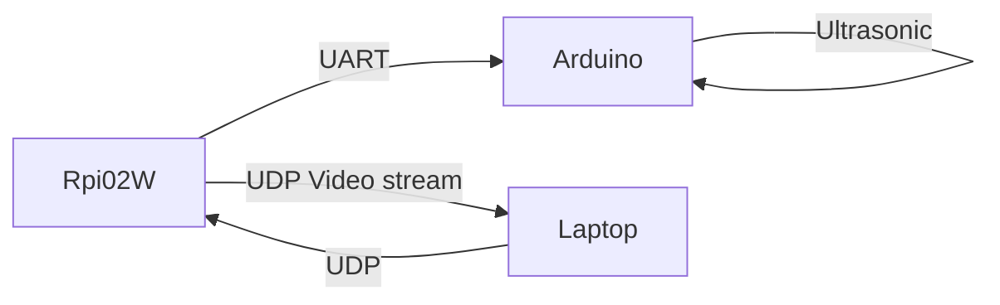
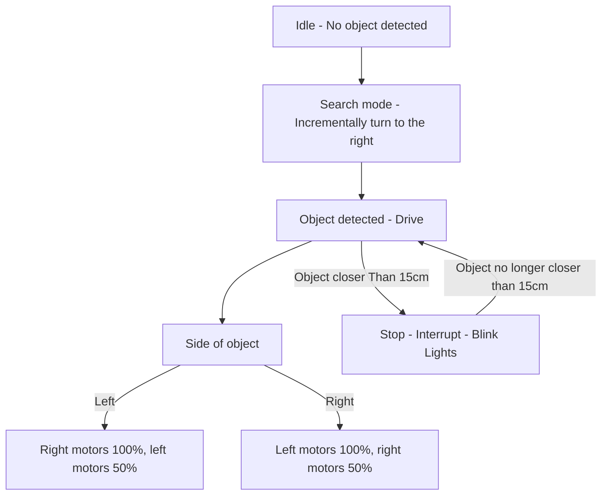

#Auto_Yolo_Robot

>Month long sprint to return this project for a microcontrollers course, and first github project

---

## Overview
A microcontroller project utilizing a raspberry pi, computer vision, and an arduino to make a robot follow other robots.

## Tech Stack 
* **ATMega328P Microcontroller in the form of standard Arduino Uno**
* **Raspberry Pi zero2w, acting as the camera streamer**
* **Languages: C++, Python**

## Flow Chart

## Logic Diagram

## Notes on the techincal execution and progress:
<pre>
[]Arduino:	
	[x]proximity sensor
		*send pulse to echo pin from the board
		*take trigger input
		*if object say less than 30cm away, interrupt everything 
		*else do nothing

	[]motors and the code to drive motors
		*engage pins, use pwm to adjust motor speed
		*header file needs to contain the object prototype
		*the main file needs to contain
			motorlogic
			*in follow,if (R), left motors drive ex.100%, 
			*elif, search(), pulse motors (R) 
			*sighting, stop and then confirm 
	Main
	*if not target in sight execute search
	*when target in sight begin follow
	*when target in sight and prox sensor less than 30cm, begin greet 
	

	[x]UART
		*take input reading from the rx pin  
[]Raspberry pi:
	*run camera
	*stream video over udp 
	*capture messages from laptop and forward them over uart to arduino
[]Laptop
	*receive a videostream from the raspberry pi
	*process the video in YOLO11n
	message protocol
		*if i see robot drive(D), if not search(S)
		*depending on where the robot is either drive right(R) or drive left(L) 
</pre>