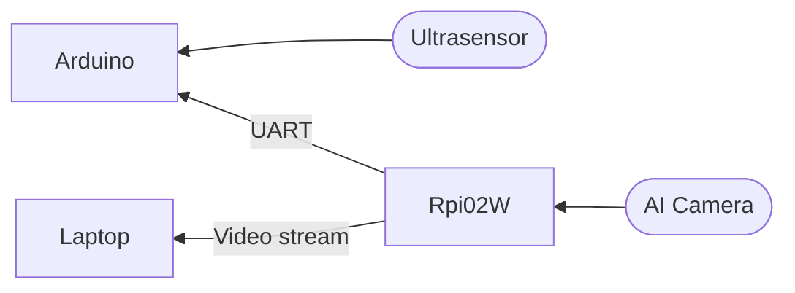
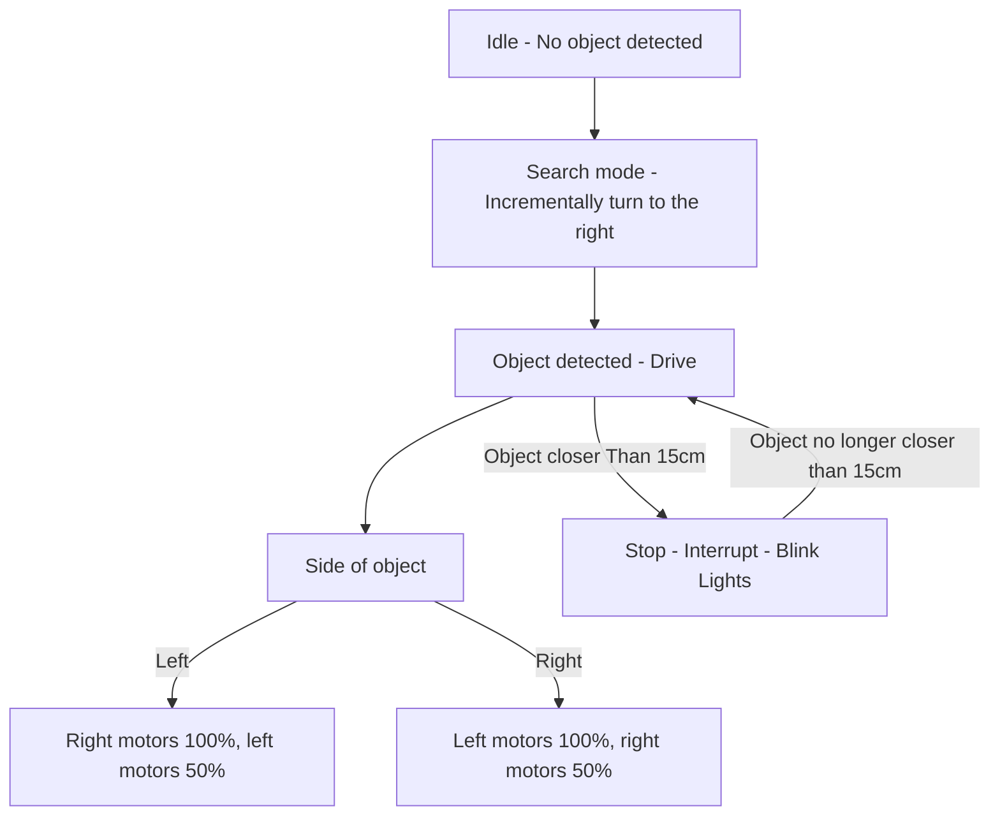

#Auto_Yolo_Robot

>Month long sprint to return this project for a microcontrollers course, and first github project

---

## Overview
A microcontroller project utilizing the Raspberry Pi AI Camera, Arduino Uno, and a Raspberry Pi zero 2w. 
The AI camera does the recognition and forwards directions through UART to the arduino, based on 
bounding box location information. The video feed is also streamed to a laptop, and captured via Gstreamer.

## Tech Stack 
* **ATMega328P Microcontroller / Arduino Uno**
* **Raspberry Pi AI Camera**
* **Raspberry Pi zero2w**
* **Gstreamer**
* **Languages: C++, Python**

## Flow Chart

## Logic Diagram

## Notes on the techincal execution and progress:

- [ ] **Arduino:** (Needs to be tested)
  - [x] **Main.cpp**
  - [x] **Proximity sensor**
    - send pulse to echo pin from the board
    - take trigger input
    - if object say less than 30cm away, interrupt everything
    - else do nothing
  - [x] **Motors and the code to drive motors**
    - engage pins, use pwm to adjust motor speed
    - header file needs to contain the object prototype
    - the main file needs to contain **Motorlogic**
      - in follow, if (R), left motors drive ex.100%
      - elif, search(), pulse motors (R)
      - sighting, stop and then confirm
  - [x] **UART**
    - take input reading from the rx pin
  - [ ] **Raspberry Pi:**
    - run camera
    - stream video over udp
    - capture messages from laptop and forward them over uart to arduino
  - [ ] **Laptop:**
    - receive a videostream from the raspberry pi
    - process the video in YOLO11n
    - **Message protocol:**
      - if i see robot drive (D), if not search (S)
      - depending on where the robot is either drive right (R) or drive left (L)
